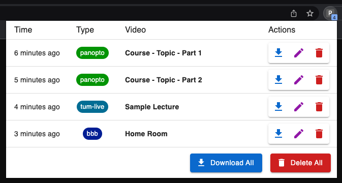

**⚠️ DISCLAIMER: Only use this tool to download videos where you have the right to do so ⚠️**

# panopto-dl

A simple chrome extension to generate ffmpeg commands to download videos from TUM panopto / TUM BigBlueButton / TUM live.



**The plugin itself cannot download videos itself. It can only generate ffmpeg commands. You need to have a local ffmpeg installation to actually download the videos.**

## Installation ⬇️

-   download the latest release from the [release page](https://github.com/leon-w/panopto-dl/releases)
-   extract the downloaded archive

-   goto `chrome://extensions`
-   enable developer mode
-   click `Load unpacked` and select the extracted folder

## How to Use ⁉️

-   open the video streaming page for a short moment and the video will get registered
-   click the extension icon to view all detected videos. A small badge indicates the amount of videos that have been registered
    -   click the video title to copy a `ffmpeg` command that will download the video as `.mp4`
    -   paste the copied command into a command line to start the download
    -   click delete to remove the video from the list

## Development 🚧

To build the extension from source, you need NodeJS + npm.
The compiled extension will be inside the `dist/` folder.

#### Setup environment:

```shell
nvm use # use the correct node version
npm install
```

#### Build the extension in dev mode (recompile on changes):

```shell
npm run watch
```

#### Build the extension in production mode:

```shell
npm run build
```

#### Clean existing build (deletes `dist/`):

```shell
npm run clean
```

#### Run the linter:

```shell
npm run lint
```
